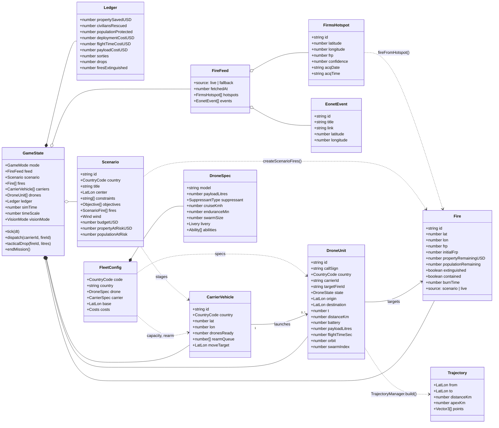
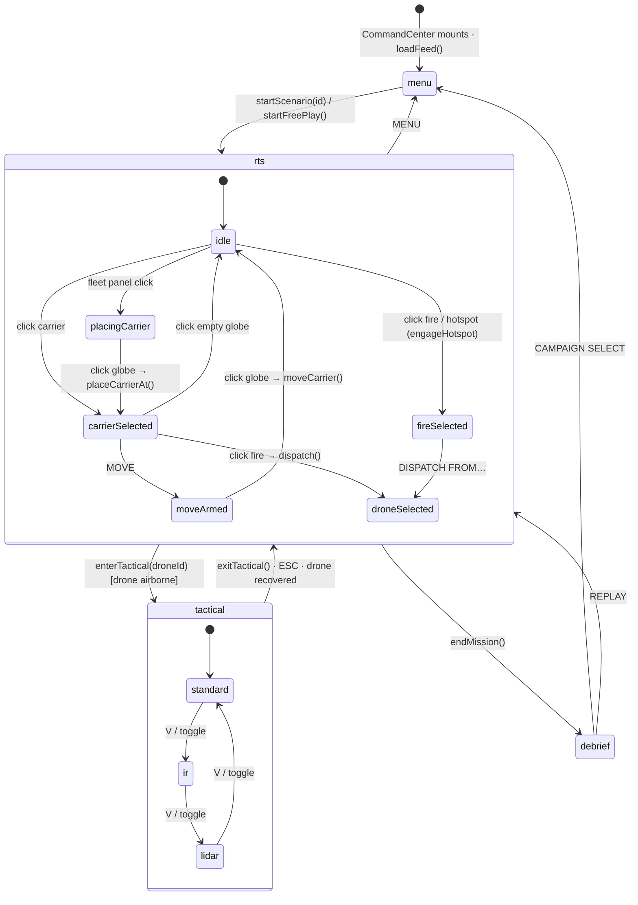
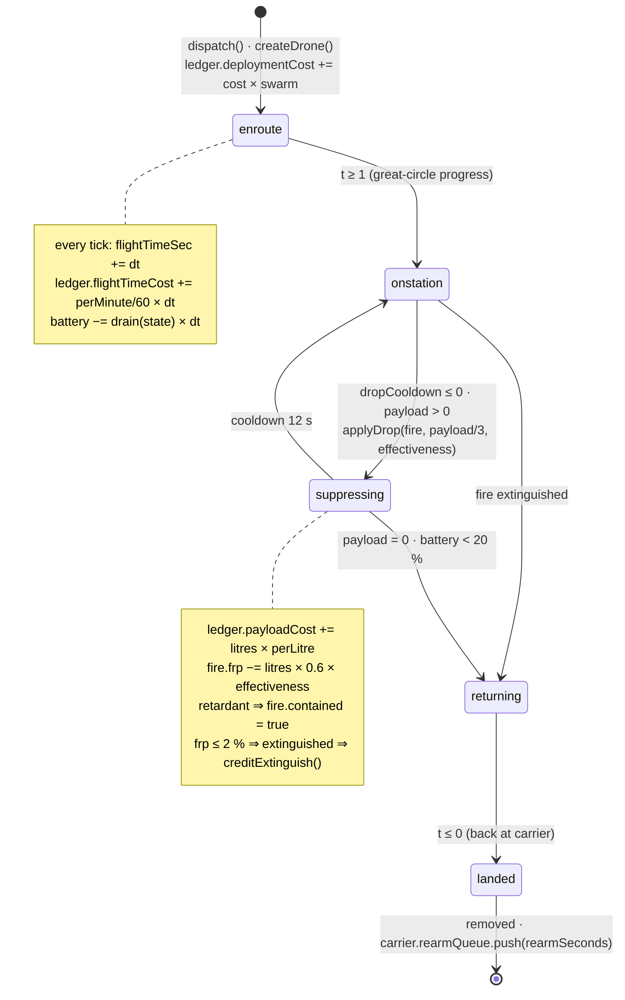
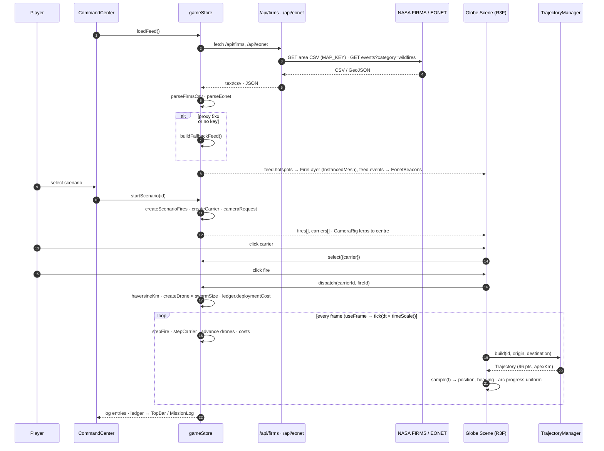
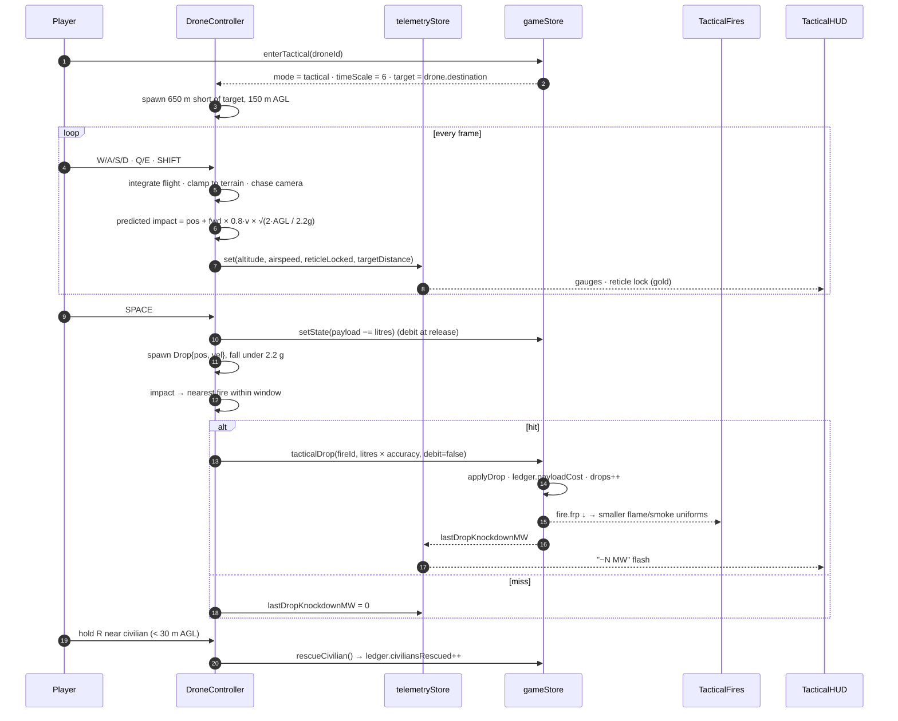
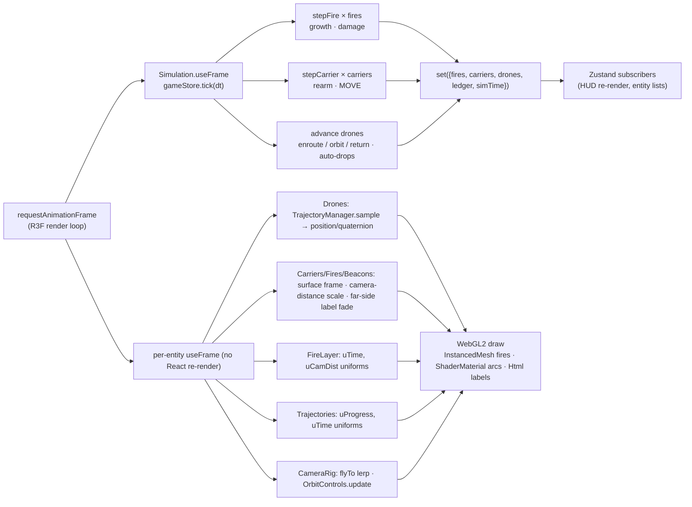

# Global Firefight - Drone Command

**🚧 Work in Progress - NDIA Hackathon Project 🚧**

Dual-mode RTS and third-person tactical firefighting simulation driven by live NASA fire data. This repository holds two builds:

- **[Web prototype](#web-prototype-god-eye-fork)** in [`web/`](web/) — Next.js 14 + Three.js / React Three Fiber, playable in the browser (documented below, with screenshots and architecture diagrams).
- **[Unity project](#unity-project-original-hackathon-build)** in [`Assets/`](Assets/) — the original Cesium for Unity hackathon build.

## Web Prototype (God Eye fork)

Dual-mode RTS / third-person tactical firefighting simulation on a live NASA fire globe.
Built with Next.js 14 (App Router), TypeScript, Tailwind, Zustand, Three.js r170 and React Three Fiber.

### Screenshots

| Campaign menu | Global RTS — free play on the live FIRMS globe |
| --- | --- |
|  |  |

| RTS dispatch — Black Summer, arc trajectory + carrier | Tactical drone view — standard colour |
| --- | --- |
|  |  |

| Tactical — retardant drop knock-down on the reticle | Tactical — IR White-Hot (PERSONNEL DETECTED, hazard callouts) |
| --- | --- |
|  |  |

| Tactical — LIDAR point cloud (canopy pathways) | Mission debrief — economic ledger |
| --- | --- |
|  |  |

Captured from a scripted headless Chromium run against the bundled fallback dataset (no FIRMS key configured).

### Run

```bash
cd web
npm install
cp .env.example .env.local   # optional — see below
npm run dev                  # http://localhost:3000
```

Without a FIRMS key the app uses a bundled fallback fire dataset so it always runs. For live data set
`FIRMS_MAP_KEY` (free key: https://firms.modaps.eosdis.nasa.gov/api/map_key/). EONET needs no key.

### Real-world 3D map (God Eye map stack)

The globe and the tactical arena are real-world 3D tiles streamed with [`3d-tiles-renderer`](https://github.com/NASA-AMMOS/3DTilesRendererJS).
The map route is chosen the same way as [gods-eye-view](https://github.com/bilawalsidhu/gods-eye-view) (`src/maps/google3d.js`):

| Credential in `web/.env.local` | Route | What you see |
| --- | --- | --- |
| `NEXT_PUBLIC_GOOGLE_MAPS_API_KEY` | **google-direct** | Google Photorealistic 3D Tiles (Map Tiles API) — buildings, trees, terrain |
| `NEXT_PUBLIC_CESIUM_ION_TOKEN` | **google-ion** | The same Google tiles served via Cesium ion asset `2275207` |
| *(neither)* | **keyless** | Globe: Re:Earth / Mapterhorn quantized-mesh terrain (CC BY 4.0) draped with Esri World Imagery. Drone view: procedural 3D terrain |
| `NEXT_PUBLIC_DISABLE_3D_TILES=1` | **off** | Vector basemap globe + procedural tactical terrain |

Both credentials are client-exposed by design (they are used in the browser) — restrict them by HTTP referrer and API scope
in the provider console. On Vercel add them as project environment variables and redeploy; `NEXT_PUBLIC_*` values are
inlined at build time.

If the tile source cannot be reached (root tileset error, or nothing within 20 s) the app falls back the way God Eye does:
the globe restores its raster basemap and the tactical view uses procedural terrain, with a `MAP UNAVAILABLE` notice in the HUD.

Photorealistic tiles in the tactical drone view require a Google or ion credential; without one the drone view keeps the
procedural heightmap terrain so it is always playable.

In the global view the tiles are scaled into the WGS84 unit-globe frame under the HUD; in the tactical view the tileset is
re-oriented so the target fire sits at the origin with +Y up, and fires, protected structures and survivors are projected from
their real coordinates and settled onto the streamed surface by raycasting the tiles. IR White-Hot swaps tile materials for a
monochrome shader; LIDAR re-renders the tile geometry as an elevation-coloured point cloud.

### Controls

| Global RTS | Tactical drone |
| --- | --- |
| Drag to orbit, wheel to zoom | `W/S` throttle, `A/D` yaw, `Q/E` altitude, `SHIFT` boost |
| Click carrier → click fire = dispatch | `SPACE` drop suppressant (reticle turns gold when the predicted impact is on a fire) |
| Click a live FIRMS hotspot to engage it | `R` (hold, < 30 m AGL, within 40 m) extract a civilian |
| `MOVE` then click globe relocates a carrier | `V` cycle Standard / IR White-Hot / LIDAR |
| Fleet panel → click a nation, then the globe, to deploy a forward carrier | `ESC` back to the global view |

### Software architecture

#### 1. Layered system architecture

```mermaid
flowchart TB
  subgraph EXT["External services"]
    FIRMS["NASA FIRMS<br/>area CSV API<br/><i>latitude, longitude, frp, confidence</i>"]
    EONET["NASA EONET v3<br/>events GeoJSON<br/><i>title, geometry, link</i>"]
    TILES["Raster tile server (optional)<br/>{z}/{x}/{y} Web Mercator"]
    NE["Natural Earth 1:110m<br/>world-atlas TopoJSON (bundled)"]
  end

  subgraph SRV["Server — Next.js 14 App Router · Node runtime"]
    RF["app/api/firms/route.ts<br/>injects FIRMS_MAP_KEY · revalidate 900 s · returns CSV"]
    RE["app/api/eonet/route.ts<br/>category=wildfires&status=open · revalidate 3600 s"]
    LAYOUT["app/layout.tsx · app/page.tsx<br/>static shell, globals.css (Tailwind)"]
  end

  subgraph CLIENT["Browser — React 18 client"]
    direction TB

    subgraph SHELL["Application shell"]
      CC["components/CommandCenter.tsx<br/>mode router · loadFeed() on mount<br/>dynamic() imports of both canvases (ssr:false)"]
    end

    subgraph DATA["Data access — lib/data"]
      PF["nasa-firms.ts<br/>parseFirmsCsv · frpToIntensity · hotspotToVector3"]
      PE["nasa-eonet.ts<br/>parseEonet (Point / Polygon centroid)"]
      FB["fallback-fires.ts<br/>seeded offline dataset (1.3k hotspots + 7 events)"]
      TY["types.ts<br/>FirmsHotspot · EonetEvent · FireFeed"]
    end

    subgraph STATE["State — Zustand"]
      GS["store/gameStore.ts<br/>mode · feed · scenario · fires[] · carriers[] · drones[]<br/>selection · ledger · simTime · timeScale · visionMode · cameraRequest<br/><b>tick(dt)</b> · dispatch · deploySuppressant · tacticalDrop · rescueCivilian · endMission"]
      TS["store/telemetryStore.ts<br/>altitude · airspeed · heading · reticleLocked · nearCivilian<br/>(per-frame, isolated from HUD re-renders)"]
    end

    subgraph DOMAIN["Domain engine — lib/engine · lib/geo · lib/config"]
      FIRE["engine/fire.ts<br/>Fire · createScenarioFires · fireFromHotspot<br/>stepFire (growth, damage) · applyDrop"]
      DU["engine/DroneUnit.ts<br/>DroneUnit · createDrone · progressRate · batteryDrainPerSec"]
      CV["engine/CarrierVehicle.ts<br/>CarrierVehicle · createCarrier · stepCarrier (rearm, MOVE)"]
      EC["engine/economics.ts<br/>Ledger · livesSavedBonus · totalSuppressionCost · finalScore · fmtUSD"]
      WGS["geo/wgs84.ts<br/>latLonToVector3 · vector3ToLatLon · haversineKm<br/>greatCirclePoint · surfaceFrame"]
      TRJ["geo/trajectory.ts<br/>TrajectoryManager · apexForDistance · sample(t)"]
      ETX["geo/earthTexture.ts<br/>buildEarthTexture (canvas from TopoJSON)"]
      FLC["config/fleets.ts<br/>FLEETS[6] · DroneSpec · CarrierSpec · costs · abilities"]
      SCC["config/scenarios.ts<br/>SCENARIOS[7] · objectives · fires · wind · budget"]
      TAC["tactical/local.ts · tactical/noise.ts<br/>toLocal (tangent plane, 0.12 compression) · terrainHeight (fBm)"]
    end

    subgraph RENDER["Rendering — Three.js r170 via React Three Fiber"]
      subgraph GL["Global RTS canvas — components/globe"]
        SC["Scene.tsx<br/>Canvas · lights · Simulation (useFrame → tick)"]
        GB["Globe.tsx<br/>unit sphere · atmosphere GLSL · click → place / MOVE"]
        TB["TileBasemap.tsx<br/>Mercator sphere patches"]
        FLR["FireLayer.tsx<br/>InstancedMesh + GLSL billboard shader<br/>size/colour/pulse ∝ log(FRP), far-side cull"]
        FE["FireEntities.tsx<br/>engaged fires · point lights · rings · labels"]
        EBc["EonetBeacons.tsx"]
        CR["Carriers.tsx · Drones.tsx<br/>surface frame orientation · orbit · swarm offsets"]
        TR["Trajectories.tsx<br/>arc polyline + progress GLSL"]
        CAMR["CameraRig.tsx<br/>OrbitControls · flyTo lerp"]
      end
      subgraph TL["Tactical canvas — components/tactical"]
        TSC["TacticalScene.tsx<br/>local arena · fires ≤ 30 km · structures · civilians"]
        TER["Terrain.tsx<br/>heightmap mesh · LIDAR point cloud · instanced trees"]
        TF["TacticalFires.tsx<br/>GLSL flame + smoke point sprites · white-hot uniform"]
        STC["Structures.tsx · Civilians.tsx"]
        DCT["DroneController.tsx<br/>keyboard flight · chase cam · ballistic drops<br/>predicted-impact reticle · rescue · telemetry"]
      end
      MD["components/models<br/>DroneModel (6 silhouettes) · CarrierModel (6x6)<br/>livery / IR / LIDAR material variants"]
    end

    subgraph HUD["HUD overlay — components/hud (DOM, Tailwind glassmorphism)"]
      TOP["TopBar<br/>net score · property · lives · cost · budget · clock · speed"]
      BOT["BottomBar<br/>selection panel · MOVE / DEPLOY SUPPRESSANT / DISPATCH<br/>fleet deployment · TACTICAL DRONE VIEW"]
      LOG["MissionLog"]
      MENU["ScenarioMenu"]
      THUD["TacticalHUD<br/>reticle · gauges · vision toggle · abilities"]
      DEB["Debrief<br/>itemised ledger · objectives · grade"]
    end
  end

  FIRMS --> RF
  EONET --> RE
  RF -- "text/csv" --> PF
  RE -- "GeoJSON" --> PE
  PF --> GS
  PE --> GS
  FB -. "on 5xx / no key" .-> GS
  TILES -. "TextureLoader" .-> TB
  NE --> ETX --> GB
  LAYOUT --> CC
  CC --> GS
  CC --> GL
  CC --> TL
  CC --> HUD
  FLC --> GS
  SCC --> GS
  FIRE --> GS
  DU --> GS
  CV --> GS
  EC --> GS
  EC --> TOP
  EC --> DEB
  WGS --> TRJ --> CR
  WGS --> TRJ --> TR
  WGS --> FLR
  WGS --> FE
  WGS --> CR
  TAC --> TSC
  TAC --> TER
  TAC --> DCT
  GS --> GL
  GS --> TL
  GS --> HUD
  DCT --> TS --> THUD
  DCT -- "tacticalDrop · rescueCivilian" --> GS
  MD --> CR
  MD --> DCT
```



#### 2. Domain model



#### 3. Application mode state machine



#### 4. Drone sortie state machine



#### 5. Sequence — data load and RTS dispatch



#### 6. Sequence — tactical drop



#### 7. Rendering pipeline per frame



#### Runtime notes

* **Simulation clock** — the RTS runs at 60× (1 real second = 1 simulated minute, with 1×/3×/8× multipliers), the tactical view at 6×. A 40 km sortie takes about a minute of real time while property loss stays gradual.
* **Coordinate systems** — globe space is a unit sphere (1 unit = 6371 km); the tactical arena is a local tangent plane in metres with 0.12× geographic compression so a 15 km fire complex fits a ±3 km flyable area.
* **Data fallback** — when either proxy fails (no key, network policy, upstream error) the store seeds a deterministic offline dataset and the HUD reports `FEED FALLBACK`.
* **Economic model** — `FinalScore = (PropertyValueSaved + LivesSavedBonus) − TotalSuppressionCost`, where lives bonus = civilians × $10M VSL + residents protected × $12.5K, and cost = deployment + flight time + payload per nation.

### Code layout

```
app/                      Next.js App Router shell + API proxies
  api/firms/route.ts      FIRMS area-CSV proxy (server-side MAP_KEY, 15-min revalidate)
  api/eonet/route.ts      EONET v3 open wildfire events proxy
lib/geo/wgs84.ts          lat/lon ⇄ globe Cartesian, haversine, great-circle interpolation
lib/geo/trajectory.ts     TrajectoryManager — great-circle arcs with parabolic altitude
lib/geo/earthTexture.ts   Dark tactical basemap from Natural Earth (world-atlas) TopoJSON (loading fallback)
lib/config/tiles.ts       Map route selection (google-direct / google-ion / keyless / off)
lib/tiles/                DRACO + BVH setup, globe surface sampler, vision-mode tile materials
components/tiles/         WorldTiles — 3d-tiles-renderer wrapper for both views (auth, terrain, imagery, attribution)
components/tactical/TacticalWorld.tsx  Terrain provider: reoriented tiles or procedural fallback
lib/data/nasa-firms.ts    CSV parser, FRP → intensity, hotspot → Vector3
lib/data/nasa-eonet.ts    GeoJSON parser (title / geometry / link)
lib/data/fallback-fires.ts Offline dataset
lib/config/fleets.ts      Six national fleets: drones, carriers, liveries, abilities, costs
lib/config/scenarios.ts   Seven pitch-deck campaign presets
lib/engine/               Fire model, DroneUnit, CarrierVehicle, economics (ledger + FinalScore)
store/gameStore.ts        Zustand store: simulation tick, dispatch, suppression, scoring
components/globe/         God Eye globe adapter: Globe, TileBasemap, instanced FireLayer shader,
                          EonetBeacons, Carriers, Drones, Trajectories, CameraRig
components/tactical/      Tactical arena: terrain + LIDAR cloud, flame/smoke particles,
                          structures, civilians, player DroneController
components/models/        Procedural drone & 6x6 carrier models per livery
components/hud/           TopBar, BottomBar, MissionLog, ScenarioMenu, TacticalHUD, Debrief
```

#### Economic model

`FinalScore = (PropertyValueSaved + LivesSavedBonus) − TotalSuppressionCost`

* Property saved is credited when a fire is extinguished (what is still standing at that moment).
* Lives Saved Bonus = civilians rescued × $10M (value of a statistical life) + residents protected × $12.5K.
* Suppression cost = deployment (per sortie) + flight time (per minute) + payload (per litre), per nation.

#### Vision modes

* **IR White-Hot** — all materials go monochrome, fires and personnel render white with
  `PERSONNEL DETECTED` and `CRITICAL STRUCTURE / VALVE HAZARD` callouts.
* **LIDAR** — terrain and canopy render as an elevation-coloured point cloud (cyan → green), buildings as wireframe,
  fires as ground rings, so pathways through smoke stay legible.

#### God Eye adaptation

[gods-eye-view](https://github.com/bilawalsidhu/gods-eye-view) is a CesiumJS console; this project's spec is Three.js / React Three Fiber, so the
same map stack (Google Photorealistic 3D Tiles directly or via Cesium ion, keyless Re:Earth terrain + Esri imagery) is streamed
through `3d-tiles-renderer` instead of Cesium. Credential names and route precedence follow God Eye's `google3d.js`; no God Eye
source is vendored.

### Scripts

`npm run dev` · `npm run build` · `npm run start` · `npm run lint` · `npm run typecheck`

---

# Unity Project (original hackathon build)

## Project Overview

Global Firefight - Drone Command is an innovative real-time strategy and simulation game developed for the NDIA (National Defense Industrial Association) Hackathon. The project combines real-world wildfire data with strategic drone fleet management to create an immersive firefighting command experience.

## Project Vision

This game transforms players into incident commanders managing international drone fleets to combat global wildfires using real-time NASA satellite data. Players switch between a strategic global view for fleet deployment and a tactical drone pilot view for precision firefighting operations.

### Key Features (In Development)

- **Real-Time Data Integration**: Live wildfire data from NASA FIRMS and EONET APIs
- **Dual-Mode Gameplay**: 
  - Strategic RTS view on a 3D globe for fleet management
  - Tactical third-person drone control for precision operations
- **Authentic Drone Fleet**: Based on real international firefighting aircraft and systems
- **Economic Impact Scoring**: Players scored on property and lives saved vs. operational costs
- **Photorealistic 3D Environment**: Powered by Google's Photorealistic 3D Tiles via Cesium for Unity

## Current Development Status

### ✅ Completed Components
- Core game architecture and state management
- NASA FIRMS API integration for real-time fire data
- Fire positioning and visualization on Cesium 3D globe
- Interactive fire selection system
- Camera transitions from global to drone view
- Basic drone deployment system
- Geospatial coordinate conversion system

### 🔄 In Progress
- Fire suppression mechanics and visual effects
- Complete drone fleet management system
- Economic scoring system implementation
- UI/UX for both strategic and tactical views
- Google Maps 3D tiles integration for tactical view

### 📋 Planned Features
- Multi-national drone specifications and capabilities
- Advanced fire spread simulation
- Resource management and logistics
- Post-mission analytics and scoring
- Performance optimization for WebGL deployment

## Technical Stack

- **Engine**: Unity 2023.x with Universal Render Pipeline (URP)
- **Geospatial**: Cesium for Unity (3D globe and coordinate systems)
- **Data Sources**: 
  - NASA FIRMS (Fire Information for Resource Management System)
  - NASA EONET (Earth Observatory Natural Event Tracker)
  - Google Maps Platform (Photorealistic 3D Tiles)
- **Platform Targets**: PC (Primary), WebGL (Secondary)

## Project Structure

```
web/               # Web prototype (Next.js + Three.js) — see above
Assets/
├── Scripts/           # Core game logic and systems
│   ├── Core/         # Game managers and state systems
│   ├── Data/         # Data models and structures
│   ├── API/          # External API integrations
│   ├── Geospatial/   # Location and coordinate systems
│   ├── Fire/         # Fire simulation and effects
│   ├── Drones/       # Drone fleet management
│   ├── Systems/      # Scoring, camera, and other systems
│   └── UI/           # User interface components
├── Research/         # Technical documentation and requirements
└── README.md         # This file
```

## Development Team

This project is being developed as part of the NDIA Hackathon, focusing on innovative applications of real-time data for emergency response and strategic planning.

## Getting Started

### Prerequisites
- Unity 2023.x or later
- NASA Earthdata API key (for FIRMS data)
- Google Cloud API key (for Maps Platform)
- Cesium for Unity plugin

### Current Build Status
The project currently compiles successfully with all core systems functional. The basic fire interaction and camera transition systems are operational for demonstration purposes.

## License

This project is developed for the NDIA Hackathon and is currently proprietary. Licensing terms will be determined based on hackathon outcomes and further development decisions.

---

**Note**: This is an active development project. Features and implementation details are subject to change as development progresses toward the hackathon deadline.
