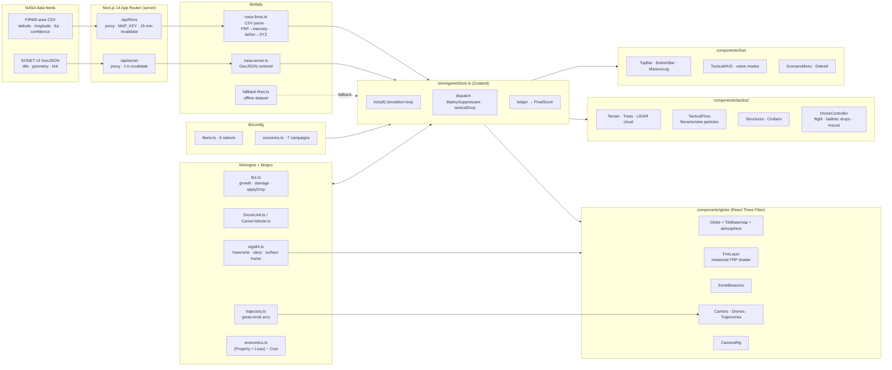

# Global Firefight: Drone Command — Web Prototype (God Eye fork)

Dual-mode RTS / third-person tactical firefighting simulation on a live NASA fire globe.
Built with Next.js 14 (App Router), TypeScript, Tailwind, Zustand, Three.js r170 and React Three Fiber.

## Screenshots

| Campaign menu | Global RTS — free play on the live FIRMS globe |
| --- | --- |
|  |  |

| RTS dispatch — Black Summer, arc trajectory + carrier | Tactical drone view — standard colour |
| --- | --- |
|  |  |

| Tactical — retardant drop knock-down on the reticle | Tactical — IR White-Hot (PERSONNEL DETECTED, hazard callouts) |
| --- | --- |
|  |  |

| Tactical — LIDAR point cloud (canopy pathways) | Mission debrief — economic ledger |
| --- | --- |
|  |  |

Captured from a scripted headless Chromium run against the bundled fallback dataset (no FIRMS key configured).

## Run

```bash
cd web
npm install
cp .env.example .env.local   # optional — see below
npm run dev                  # http://localhost:3000
```

Without a FIRMS key the app uses a bundled fallback fire dataset so it always runs. For live data set
`FIRMS_MAP_KEY` (free key: https://firms.modaps.eosdis.nasa.gov/api/map_key/). EONET needs no key.
Set `NEXT_PUBLIC_BASEMAP_TILE_URL` to a `{z}/{x}/{y}` raster template to stream a tile basemap onto the globe.

## Controls

| Global RTS | Tactical drone |
| --- | --- |
| Drag to orbit, wheel to zoom | `W/S` throttle, `A/D` yaw, `Q/E` altitude, `SHIFT` boost |
| Click carrier → click fire = dispatch | `SPACE` drop suppressant (reticle turns gold when the predicted impact is on a fire) |
| Click a live FIRMS hotspot to engage it | `R` (hold, < 30 m AGL, within 40 m) extract a civilian |
| `MOVE` then click globe relocates a carrier | `V` cycle Standard / IR White-Hot / LIDAR |
| Fleet panel → click a nation, then the globe, to deploy a forward carrier | `ESC` back to the global view |

## Technical architecture



### Runtime flow

1. **Boot** — `CommandCenter` mounts, `loadFeed()` fetches both proxies; on failure it seeds the fallback dataset.
2. **Scenario start** — a preset positions the camera, creates `Fire` entities with property/population at risk, and stages the national carrier.
3. **Dispatch** — selecting a carrier and clicking a fire builds a great-circle `Trajectory`; a `DroneUnit` (or swarm) animates along it with a parabolic altitude profile.
4. **Suppression** — on arrival drones orbit and drop on a cooldown; `applyDrop` knocks FRP down, retardant marks the fire *contained*, and extinguishing credits the ledger.
5. **Tactical** — `TACTICAL DRONE VIEW` swaps the globe canvas for the local arena; the player flies, drops (ballistic, predicted-impact reticle), rescues civilians, and cycles Standard / IR / LIDAR.
6. **Debrief** — `END MISSION` renders the itemised ledger and grade.

### Simulation clock

The RTS runs at 60× (1 real second = 1 simulated minute; selectable 1×/3×/8× multipliers), the tactical view at 6×, so a 40 km sortie takes about a minute of real time while property loss remains gradual.

## Code layout

```
app/                      Next.js App Router shell + API proxies
  api/firms/route.ts      FIRMS area-CSV proxy (server-side MAP_KEY, 15-min revalidate)
  api/eonet/route.ts      EONET v3 open wildfire events proxy
lib/geo/wgs84.ts          lat/lon ⇄ globe Cartesian, haversine, great-circle interpolation
lib/geo/trajectory.ts     TrajectoryManager — great-circle arcs with parabolic altitude
lib/geo/earthTexture.ts   Dark tactical basemap from Natural Earth (world-atlas) TopoJSON
lib/data/nasa-firms.ts    CSV parser, FRP → intensity, hotspot → Vector3
lib/data/nasa-eonet.ts    GeoJSON parser (title / geometry / link)
lib/data/fallback-fires.ts Offline dataset
lib/config/fleets.ts      Six national fleets: drones, carriers, liveries, abilities, costs
lib/config/scenarios.ts   Seven pitch-deck campaign presets
lib/engine/               Fire model, DroneUnit, CarrierVehicle, economics (ledger + FinalScore)
store/gameStore.ts        Zustand store: simulation tick, dispatch, suppression, scoring
components/globe/         God Eye globe adapter: Globe, TileBasemap, instanced FireLayer shader,
                          EonetBeacons, Carriers, Drones, Trajectories, CameraRig
components/tactical/      Tactical arena: terrain + LIDAR cloud, flame/smoke particles,
                          structures, civilians, player DroneController
components/models/        Procedural drone & 6x6 carrier models per livery
components/hud/           TopBar, BottomBar, MissionLog, ScenarioMenu, TacticalHUD, Debrief
```

### Economic model

`FinalScore = (PropertyValueSaved + LivesSavedBonus) − TotalSuppressionCost`

* Property saved is credited when a fire is extinguished (what is still standing at that moment).
* Lives Saved Bonus = civilians rescued × $10M (value of a statistical life) + residents protected × $12.5K.
* Suppression cost = deployment (per sortie) + flight time (per minute) + payload (per litre), per nation.

### Vision modes

* **IR White-Hot** — all materials go monochrome, fires and personnel render white with
  `PERSONNEL DETECTED` and `CRITICAL STRUCTURE / VALVE HAZARD` callouts.
* **LIDAR** — terrain and canopy render as an elevation-coloured point cloud (cyan → green), buildings as wireframe,
  fires as ground rings, so pathways through smoke stay legible.

### God Eye adaptation

The globe layer follows God Eye's approach (unit-sphere WGS84 globe, streamed Web-Mercator raster tiles as sphere
patches, fresnel atmosphere) but is re-implemented here in React Three Fiber; no God Eye source is vendored.

## Scripts

`npm run dev` · `npm run build` · `npm run start` · `npm run lint` · `npm run typecheck`
